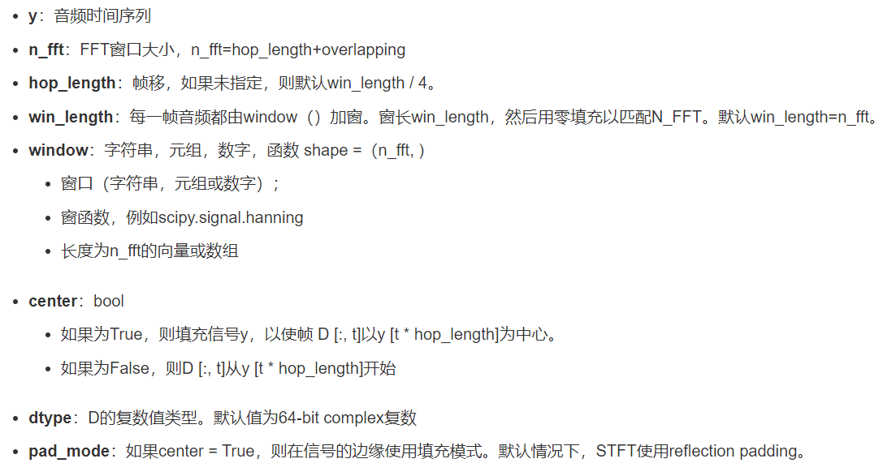

## 音频信号处理-短时傅里叶变换

短时距傅里叶变换(STFT)的过程是将长时间信号分成数个较短的等长信号，然后再分别计算每个较短段的傅里叶变换。

傅里叶变换就是把任意周期函数拆分为不同振幅和相位的正弦波的叠加。


首先我们会通过 `librosa.stft` 来计算短时傅里叶变换，类似下面这种的：

这个会返回一个复数矩阵。下面这个矩阵的shape为(257, 1087)，实部表示幅度，虚部表示相位。

参数如下



返回如下


```
[[-8.7862345e-04+0.00000000e+00j -2.2096888e-03+0.00000000e+00j
   1.2903118e-03+0.00000000e+00j ...  2.7335407e-03+0.00000000e+00j
   8.3813362e-04+0.00000000e+00j  3.5037316e-05+0.00000000e+00j]
 [ 2.4188282e-03-8.67891134e-19j  1.7699588e-03-3.08375596e-03j
  -2.8150345e-03+2.52173725e-03j ...  6.5815290e-03+2.22269502e-02j
   1.4372195e-02-1.47196148e-02j -3.5993620e-03-4.96661291e-03j]
 [-2.2968734e-03-8.29510987e-19j  8.5403293e-04+8.33244715e-03j
   4.8752069e-03+1.05045468e-03j ... -2.7495099e-02-4.64806482e-02j
  -4.1153681e-02+1.61698982e-02j  7.5940369e-04+1.27456924e-02j]
 ...
 [-1.1797601e-06-2.42982334e-20j -1.8689968e-07-3.83436856e-07j
  -2.0414634e-06-4.97767815e-07j ... -2.6186171e-06-3.42778503e-06j
  -1.7155244e-06-1.18025255e-05j  1.6185702e-05-3.28813279e-08j]
 [-1.0722626e-08+5.47395042e-20j -3.6370768e-08-1.72196891e-07j
   3.6591229e-07-3.60005799e-07j ...  6.3894004e-06+5.33426555e-06j
   1.4027224e-05+2.64116534e-06j -9.6031226e-06-9.26677239e-06j]
 [ 2.4577091e-07+0.00000000e+00j  6.4084304e-07+0.00000000e+00j
   1.1244428e-07+0.00000000e+00j ... -8.8639181e-06+0.00000000e+00j
  -1.6661954e-05+0.00000000e+00j  6.6385651e-06+0.00000000e+00j]]
```


这个时候，我们还需要对数据进行处理，使用 `librosa.magphase` 来计算前面得到的相位幅值。然后就把复数变成了方便处理的正整数

```
 [[8.7862345e-04 2.2096888e-03 1.2903118e-03 ... 2.7335407e-03
  8.3813362e-04 3.5037316e-05]
 [2.4188282e-03 3.5556019e-03 3.7793622e-03 ... 2.3180895e-02
  2.0572484e-02 6.1337305e-03]
 [2.2968734e-03 8.3761001e-03 4.9870932e-03 ... 5.4003991e-02
  4.4216413e-02 1.2768296e-02]
 ...
 [1.1797601e-06 4.2656220e-07 2.1012725e-06 ... 4.3135678e-06
  1.1926551e-05 1.6185735e-05]
 [1.0722626e-08 1.7599604e-07 5.1331858e-07 ... 8.3233899e-06
  1.4273709e-05 1.3345150e-05]
 [2.4577091e-07 6.4084304e-07 1.1244428e-07 ... 8.8639181e-06
  1.6661954e-05 6.6385651e-06]]
```

最后我们还需求平均和归一化处理，得到的结果如下， shape统一为 (1, 257, 257)
```
[[[-0.5057819  -0.25593752 -0.21417119 ... -0.27666205 -0.2809129
   -0.2647475 ]
  [-0.5109917  -0.25317347 -0.21248049 ... -0.27146083 -0.27900738
   -0.26125464]
  [-0.4851079  -0.24138778 -0.21004972 ... -0.25593686 -0.2781899
   -0.2455108 ]
  ...
  [-0.5261905  -0.26040325 -0.21516055 ... -0.27871963 -0.28661415
   -0.2664875 ]
  [-0.5260146  -0.26066384 -0.2152156  ... -0.27873284 -0.28669423
   -0.26643476]
  [-0.52626514 -0.26070327 -0.21524274 ... -0.27878895 -0.28677294
   -0.26645288]]]
```

## RestNet网络

ResNet是在2015年提出的，也叫 深度残差网络，广泛应用于图像分类等领域。这里我们用的是resnet32的结构。

详细原理这里不介绍了，感兴趣可以自行研究，我们这个网络的结构如下

```
----------------------------------------------------------------
        Layer (type)               Output Shape         Param #
================================================================
            Conv2d-1         [-1, 64, 255, 255]             576
       BatchNorm2d-2         [-1, 64, 255, 255]             128
             PReLU-3         [-1, 64, 255, 255]               1
         MaxPool2d-4           [-1, 64, 85, 85]               0
       BatchNorm2d-5           [-1, 64, 85, 85]             128
            Conv2d-6           [-1, 64, 85, 85]          36,928
       BatchNorm2d-7           [-1, 64, 85, 85]             128
             PReLU-8           [-1, 64, 85, 85]               1
            Conv2d-9           [-1, 64, 85, 85]          36,928
      BatchNorm2d-10           [-1, 64, 85, 85]             128
AdaptiveAvgPool2d-11             [-1, 64, 1, 1]               0
           Linear-12                    [-1, 4]             260
            PReLU-13                    [-1, 4]               1
           Linear-14                   [-1, 64]             320
          Sigmoid-15                   [-1, 64]               0
          SEBlock-16           [-1, 64, 85, 85]               0
            PReLU-17           [-1, 64, 85, 85]               1
          IRBlock-18           [-1, 64, 85, 85]               0
      BatchNorm2d-19           [-1, 64, 85, 85]             128
           Conv2d-20           [-1, 64, 85, 85]          36,928
      BatchNorm2d-21           [-1, 64, 85, 85]             128
            PReLU-22           [-1, 64, 85, 85]               1
           Conv2d-23           [-1, 64, 85, 85]          36,928
      BatchNorm2d-24           [-1, 64, 85, 85]             128
AdaptiveAvgPool2d-25             [-1, 64, 1, 1]               0
           Linear-26                    [-1, 4]             260
            PReLU-27                    [-1, 4]               1
           Linear-28                   [-1, 64]             320
          Sigmoid-29                   [-1, 64]               0
          SEBlock-30           [-1, 64, 85, 85]               0
            PReLU-31           [-1, 64, 85, 85]               1
          IRBlock-32           [-1, 64, 85, 85]               0
      BatchNorm2d-33           [-1, 64, 85, 85]             128
           Conv2d-34           [-1, 64, 85, 85]          36,928
      BatchNorm2d-35           [-1, 64, 85, 85]             128
            PReLU-36           [-1, 64, 85, 85]               1
           Conv2d-37           [-1, 64, 85, 85]          36,928
      BatchNorm2d-38           [-1, 64, 85, 85]             128
AdaptiveAvgPool2d-39             [-1, 64, 1, 1]               0
           Linear-40                    [-1, 4]             260
            PReLU-41                    [-1, 4]               1
           Linear-42                   [-1, 64]             320
          Sigmoid-43                   [-1, 64]               0
          SEBlock-44           [-1, 64, 85, 85]               0
            PReLU-45           [-1, 64, 85, 85]               1
          IRBlock-46           [-1, 64, 85, 85]               0
      BatchNorm2d-47           [-1, 64, 85, 85]             128
           Conv2d-48           [-1, 64, 85, 85]          36,928
      BatchNorm2d-49           [-1, 64, 85, 85]             128
            PReLU-50           [-1, 64, 85, 85]               1
           Conv2d-51          [-1, 128, 43, 43]          73,856
      BatchNorm2d-52          [-1, 128, 43, 43]             256
AdaptiveAvgPool2d-53            [-1, 128, 1, 1]               0
           Linear-54                    [-1, 8]           1,032
            PReLU-55                    [-1, 8]               1
           Linear-56                  [-1, 128]           1,152
          Sigmoid-57                  [-1, 128]               0
          SEBlock-58          [-1, 128, 43, 43]               0
           Conv2d-59          [-1, 128, 43, 43]           8,192
      BatchNorm2d-60          [-1, 128, 43, 43]             256
            PReLU-61          [-1, 128, 43, 43]               1
          IRBlock-62          [-1, 128, 43, 43]               0
      BatchNorm2d-63          [-1, 128, 43, 43]             256
           Conv2d-64          [-1, 128, 43, 43]         147,584
      BatchNorm2d-65          [-1, 128, 43, 43]             256
            PReLU-66          [-1, 128, 43, 43]               1
           Conv2d-67          [-1, 128, 43, 43]         147,584
      BatchNorm2d-68          [-1, 128, 43, 43]             256
AdaptiveAvgPool2d-69            [-1, 128, 1, 1]               0
           Linear-70                    [-1, 8]           1,032
            PReLU-71                    [-1, 8]               1
           Linear-72                  [-1, 128]           1,152
          Sigmoid-73                  [-1, 128]               0
          SEBlock-74          [-1, 128, 43, 43]               0
            PReLU-75          [-1, 128, 43, 43]               1
          IRBlock-76          [-1, 128, 43, 43]               0
      BatchNorm2d-77          [-1, 128, 43, 43]             256
           Conv2d-78          [-1, 128, 43, 43]         147,584
      BatchNorm2d-79          [-1, 128, 43, 43]             256
            PReLU-80          [-1, 128, 43, 43]               1
           Conv2d-81          [-1, 128, 43, 43]         147,584
      BatchNorm2d-82          [-1, 128, 43, 43]             256
AdaptiveAvgPool2d-83            [-1, 128, 1, 1]               0
           Linear-84                    [-1, 8]           1,032
            PReLU-85                    [-1, 8]               1
           Linear-86                  [-1, 128]           1,152
          Sigmoid-87                  [-1, 128]               0
          SEBlock-88          [-1, 128, 43, 43]               0
            PReLU-89          [-1, 128, 43, 43]               1
          IRBlock-90          [-1, 128, 43, 43]               0
      BatchNorm2d-91          [-1, 128, 43, 43]             256
           Conv2d-92          [-1, 128, 43, 43]         147,584
      BatchNorm2d-93          [-1, 128, 43, 43]             256
            PReLU-94          [-1, 128, 43, 43]               1
           Conv2d-95          [-1, 128, 43, 43]         147,584
      BatchNorm2d-96          [-1, 128, 43, 43]             256
AdaptiveAvgPool2d-97            [-1, 128, 1, 1]               0
           Linear-98                    [-1, 8]           1,032
            PReLU-99                    [-1, 8]               1
          Linear-100                  [-1, 128]           1,152
         Sigmoid-101                  [-1, 128]               0
         SEBlock-102          [-1, 128, 43, 43]               0
           PReLU-103          [-1, 128, 43, 43]               1
         IRBlock-104          [-1, 128, 43, 43]               0
     BatchNorm2d-105          [-1, 128, 43, 43]             256
          Conv2d-106          [-1, 128, 43, 43]         147,584
     BatchNorm2d-107          [-1, 128, 43, 43]             256
           PReLU-108          [-1, 128, 43, 43]               1
          Conv2d-109          [-1, 256, 22, 22]         295,168
     BatchNorm2d-110          [-1, 256, 22, 22]             512
AdaptiveAvgPool2d-111            [-1, 256, 1, 1]               0
          Linear-112                   [-1, 16]           4,112
           PReLU-113                   [-1, 16]               1
          Linear-114                  [-1, 256]           4,352
         Sigmoid-115                  [-1, 256]               0
         SEBlock-116          [-1, 256, 22, 22]               0
          Conv2d-117          [-1, 256, 22, 22]          32,768
     BatchNorm2d-118          [-1, 256, 22, 22]             512
           PReLU-119          [-1, 256, 22, 22]               1
         IRBlock-120          [-1, 256, 22, 22]               0
     BatchNorm2d-121          [-1, 256, 22, 22]             512
          Conv2d-122          [-1, 256, 22, 22]         590,080
     BatchNorm2d-123          [-1, 256, 22, 22]             512
           PReLU-124          [-1, 256, 22, 22]               1
          Conv2d-125          [-1, 256, 22, 22]         590,080
     BatchNorm2d-126          [-1, 256, 22, 22]             512
AdaptiveAvgPool2d-127            [-1, 256, 1, 1]               0
          Linear-128                   [-1, 16]           4,112
           PReLU-129                   [-1, 16]               1
          Linear-130                  [-1, 256]           4,352
         Sigmoid-131                  [-1, 256]               0
         SEBlock-132          [-1, 256, 22, 22]               0
           PReLU-133          [-1, 256, 22, 22]               1
         IRBlock-134          [-1, 256, 22, 22]               0
     BatchNorm2d-135          [-1, 256, 22, 22]             512
          Conv2d-136          [-1, 256, 22, 22]         590,080
     BatchNorm2d-137          [-1, 256, 22, 22]             512
           PReLU-138          [-1, 256, 22, 22]               1
          Conv2d-139          [-1, 256, 22, 22]         590,080
     BatchNorm2d-140          [-1, 256, 22, 22]             512
AdaptiveAvgPool2d-141            [-1, 256, 1, 1]               0
          Linear-142                   [-1, 16]           4,112
           PReLU-143                   [-1, 16]               1
          Linear-144                  [-1, 256]           4,352
         Sigmoid-145                  [-1, 256]               0
         SEBlock-146          [-1, 256, 22, 22]               0
           PReLU-147          [-1, 256, 22, 22]               1
         IRBlock-148          [-1, 256, 22, 22]               0
     BatchNorm2d-149          [-1, 256, 22, 22]             512
          Conv2d-150          [-1, 256, 22, 22]         590,080
     BatchNorm2d-151          [-1, 256, 22, 22]             512
           PReLU-152          [-1, 256, 22, 22]               1
          Conv2d-153          [-1, 256, 22, 22]         590,080
     BatchNorm2d-154          [-1, 256, 22, 22]             512
AdaptiveAvgPool2d-155            [-1, 256, 1, 1]               0
          Linear-156                   [-1, 16]           4,112
           PReLU-157                   [-1, 16]               1
          Linear-158                  [-1, 256]           4,352
         Sigmoid-159                  [-1, 256]               0
         SEBlock-160          [-1, 256, 22, 22]               0
           PReLU-161          [-1, 256, 22, 22]               1
         IRBlock-162          [-1, 256, 22, 22]               0
     BatchNorm2d-163          [-1, 256, 22, 22]             512
          Conv2d-164          [-1, 256, 22, 22]         590,080
     BatchNorm2d-165          [-1, 256, 22, 22]             512
           PReLU-166          [-1, 256, 22, 22]               1
          Conv2d-167          [-1, 256, 22, 22]         590,080
     BatchNorm2d-168          [-1, 256, 22, 22]             512
AdaptiveAvgPool2d-169            [-1, 256, 1, 1]               0
          Linear-170                   [-1, 16]           4,112
           PReLU-171                   [-1, 16]               1
          Linear-172                  [-1, 256]           4,352
         Sigmoid-173                  [-1, 256]               0
         SEBlock-174          [-1, 256, 22, 22]               0
           PReLU-175          [-1, 256, 22, 22]               1
         IRBlock-176          [-1, 256, 22, 22]               0
     BatchNorm2d-177          [-1, 256, 22, 22]             512
          Conv2d-178          [-1, 256, 22, 22]         590,080
     BatchNorm2d-179          [-1, 256, 22, 22]             512
           PReLU-180          [-1, 256, 22, 22]               1
          Conv2d-181          [-1, 256, 22, 22]         590,080
     BatchNorm2d-182          [-1, 256, 22, 22]             512
AdaptiveAvgPool2d-183            [-1, 256, 1, 1]               0
          Linear-184                   [-1, 16]           4,112
           PReLU-185                   [-1, 16]               1
          Linear-186                  [-1, 256]           4,352
         Sigmoid-187                  [-1, 256]               0
         SEBlock-188          [-1, 256, 22, 22]               0
           PReLU-189          [-1, 256, 22, 22]               1
         IRBlock-190          [-1, 256, 22, 22]               0
     BatchNorm2d-191          [-1, 256, 22, 22]             512
          Conv2d-192          [-1, 256, 22, 22]         590,080
     BatchNorm2d-193          [-1, 256, 22, 22]             512
           PReLU-194          [-1, 256, 22, 22]               1
          Conv2d-195          [-1, 512, 11, 11]       1,180,160
     BatchNorm2d-196          [-1, 512, 11, 11]           1,024
AdaptiveAvgPool2d-197            [-1, 512, 1, 1]               0
          Linear-198                   [-1, 32]          16,416
           PReLU-199                   [-1, 32]               1
          Linear-200                  [-1, 512]          16,896
         Sigmoid-201                  [-1, 512]               0
         SEBlock-202          [-1, 512, 11, 11]               0
          Conv2d-203          [-1, 512, 11, 11]         131,072
     BatchNorm2d-204          [-1, 512, 11, 11]           1,024
           PReLU-205          [-1, 512, 11, 11]               1
         IRBlock-206          [-1, 512, 11, 11]               0
     BatchNorm2d-207          [-1, 512, 11, 11]           1,024
          Conv2d-208          [-1, 512, 11, 11]       2,359,808
     BatchNorm2d-209          [-1, 512, 11, 11]           1,024
           PReLU-210          [-1, 512, 11, 11]               1
          Conv2d-211          [-1, 512, 11, 11]       2,359,808
     BatchNorm2d-212          [-1, 512, 11, 11]           1,024
AdaptiveAvgPool2d-213            [-1, 512, 1, 1]               0
          Linear-214                   [-1, 32]          16,416
           PReLU-215                   [-1, 32]               1
          Linear-216                  [-1, 512]          16,896
         Sigmoid-217                  [-1, 512]               0
         SEBlock-218          [-1, 512, 11, 11]               0
           PReLU-219          [-1, 512, 11, 11]               1
         IRBlock-220          [-1, 512, 11, 11]               0
     BatchNorm2d-221          [-1, 512, 11, 11]           1,024
          Conv2d-222          [-1, 512, 11, 11]       2,359,808
     BatchNorm2d-223          [-1, 512, 11, 11]           1,024
           PReLU-224          [-1, 512, 11, 11]               1
          Conv2d-225          [-1, 512, 11, 11]       2,359,808
     BatchNorm2d-226          [-1, 512, 11, 11]           1,024
AdaptiveAvgPool2d-227            [-1, 512, 1, 1]               0
          Linear-228                   [-1, 32]          16,416
           PReLU-229                   [-1, 32]               1
          Linear-230                  [-1, 512]          16,896
         Sigmoid-231                  [-1, 512]               0
         SEBlock-232          [-1, 512, 11, 11]               0
           PReLU-233          [-1, 512, 11, 11]               1
         IRBlock-234          [-1, 512, 11, 11]               0
AdaptiveMaxPool2d-235            [-1, 512, 1, 1]               0
     BatchNorm2d-236            [-1, 512, 1, 1]           1,024
         Dropout-237            [-1, 512, 1, 1]               0
         Flatten-238                  [-1, 512]               0
          Linear-239                  [-1, 512]         262,656
     BatchNorm1d-240                  [-1, 512]           1,024
================================================================
Total params: 19,392,221
Trainable params: 19,392,221
Non-trainable params: 0
```

这个模型会输出512个参数，当然有这个模型还不够，我们还需要一个好的loss函数，好的loss函数可以提高模型的一个准确率。

## ArcFace Loss

ArcFace loss也叫加性角度间隔损失函数，他可以对特征向量和权重进行归一化和加性角度间隔，提高了类间可分性同时加强类内紧度和类间差异。

具体原理也不讲，感兴趣的可以自行研究。其实ArcFace主要还是用于人脸识别领域，声纹具体和人脸类似的特征，所以可以直接搬来用。。。

## 相似度判断

这里我们可以使用对角余弦值来判断两个特征的相似程度，计算方式如下：

```
score = np.dot(feature, person_f) / (np.linalg.norm(feature) * np.linalg.norm(person_f))
```

结果会在`-1 - 1`之间，如果是1就表示两个值完全一致，越大相似度会越高

## 参考文章：
- https://blog.csdn.net/sinat_35821976/article/details/105739909
- https://zhuanlan.zhihu.com/p/76541084
- https://blog.csdn.net/m0_37192554/article/details/84874344